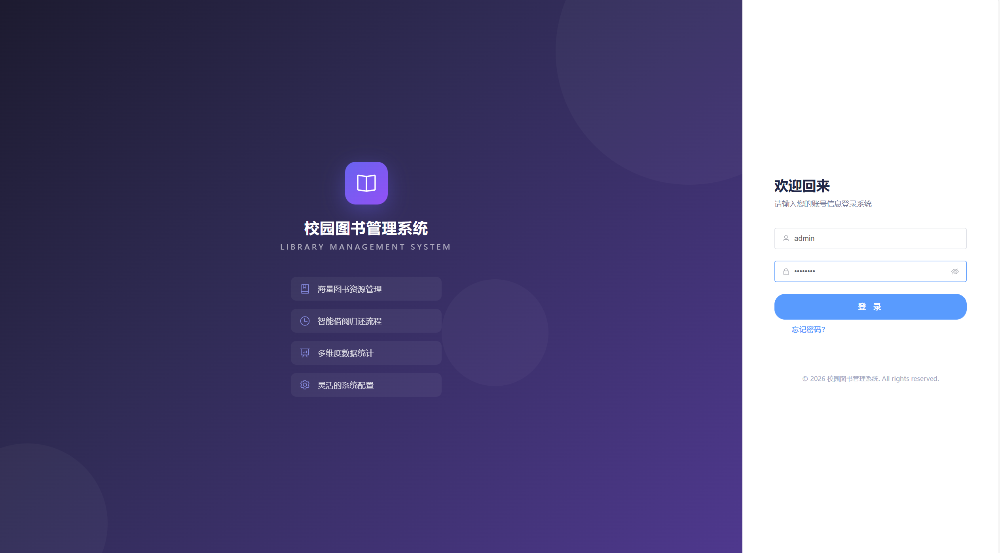
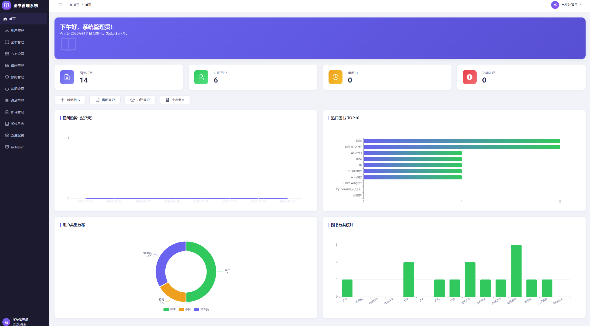
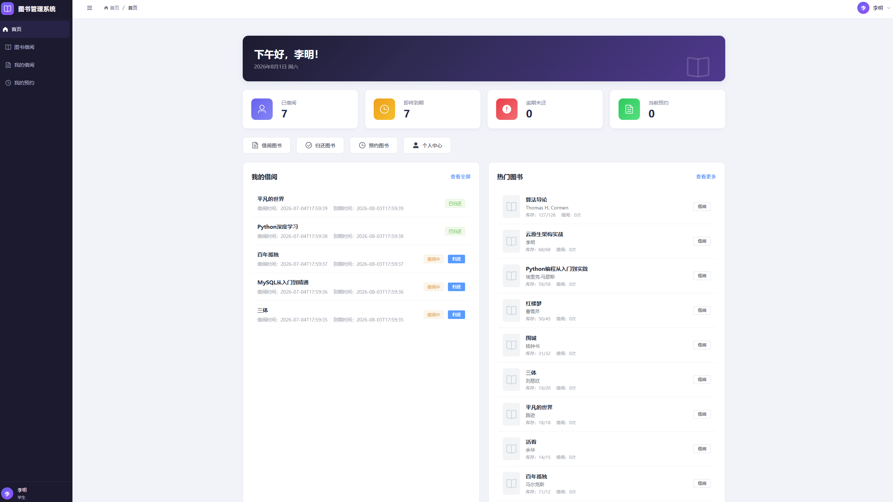
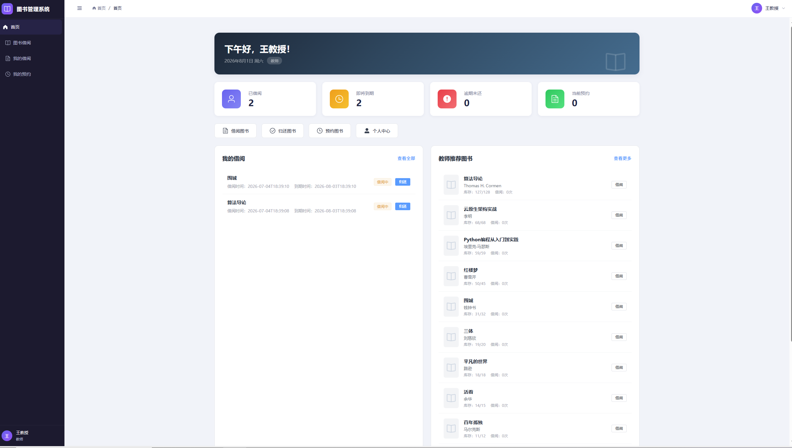

# 校园图书管理系统

## 项目简介

基于 Vue 3 + Spring Boot 技术栈实现的校园图书管理系统，支持学生、教师、管理员三种角色，提供图书借阅、归还、预约、数据统计等功能。

## 技术栈

### 前端
- Vue 3.4 + Vite 5.2
- Element Plus 2.6
- Pinia 2.1
- Vue Router 4.3
- Axios 1.6
- ECharts 5.5
- Sass

### 后端
- Spring Boot 2.7
- Spring Security + JWT
- MyBatis-Plus 3.5
- MySQL 8.0
- Redis
- Apache POI (Excel)
- SpringDoc (API文档)
- Hutool (工具库)

## 功能模块

### 用户端（学生/教师）
- 图书浏览与搜索
- 图书借阅/归还/续借
- 图书预约
- 借阅记录查询
- 个人信息管理
- 忘记密码

### 管理端（管理员）
- 用户管理
- 图书管理（CRUD/批量导入）
- 借阅管理
- 图书分类管理
- 数据统计与可视化
- 密码管理

## 角色权限

| 功能 | 学生 | 教师 | 管理员 |
|------|------|------|--------|
| 图书浏览 | ✅ | ✅ | ✅ |
| 图书借阅 | ✅ | ✅ | ✅ |
| 借阅上限 | 10本 | 15本 | - |
| 借阅期限 | 30天 | 60天 | - |
| 用户管理 | ❌ | ❌ | ✅ |
| 图书管理 | ❌ | ❌ | ✅ |
| 数据统计 | ❌ | ❌ | ✅ |

## 快速开始

### 环境要求
- JDK 1.8+
- Node.js 16+
- MySQL 8.0+
- Redis 
- Maven 3.6+

### 1. 数据库配置

### 2. 后端启动

### 3. 前端启动

## 技术亮点

1. **基于角色的权限控制** - 不同角色看到不同菜单和功能
2. **JWT Token认证** - 安全的无状态认证机制
3. **响应式设计** - 适配不同屏幕尺寸
4. **Excel批量导入** - 支持图书数据批量导入
5. **数据可视化** - ECharts图表展示统计数据
6. **忘记密码功能** - 支持账号+用户名验证找回密码

## 成果展示
## 管理员界面

## 学生界面

## 教师界面
